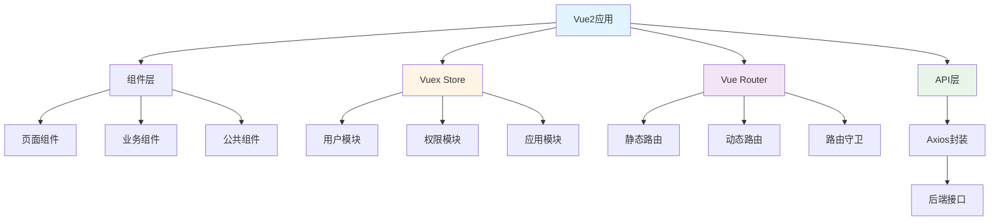

# 🎨 JOSP-SystemTempleVue2 - vue-element-admin系统前端(Vue2版)


> 基于vue-element-admin模板的Vue2前端系统

## 📖 项目简介

JOSP-SystemTempleVue2 是基于vue-element-admin模板构建的Vue2前端项目,提供企业级后台管理系统的完整解决方案,包含权限管理、动态路由、图表展示等功能。

**后端项目**: [JOSP-SystemTempleJava](../JOSP-SystemTempleJava)

**技术来源**: vue-element-admin (作者: Pan)

### ✨ 核心特性

- 🎨 **Element UI** - 经典的Vue2组件库
- 💾 **Vuex状态管理** - 集中式状态管理
- 🔐 **权限管理** - 完整的RBAC权限控制
- 🎯 **动态路由** - 根据权限动态加载路由
- 📊 **图表展示** - 集成ECharts
- 🎭 **主题定制** - 可自定义主题色

## 🏗️ 系统架构



## 🛠️ 技术栈

| 技术 | 版本 | 说明 |
|------|------|------|
| Vue | 2.6.14 | 渐进式框架 |
| Element UI | 2.15.14 | UI组件库 |
| Vuex | 3.6.2 | 状态管理 |
| Vue Router | 3.6.5 | 路由管理 |
| Axios | 0.27.2 | HTTP客户端 |
| ECharts | 5.4.3 | 图表库 |

## 🚀 快速开始

```bash
# 安装依赖
npm install

# 启动开发服务器
npm run serve

# 构建生产版本
npm run build

# 代码检查
npm run lint
```

## 📁 项目结构

```
JOSP-SystemTempleVue2/
├── public/             # 静态资源
├── src/
│   ├── api/           # API接口
│   ├── assets/        # 资源文件
│   ├── components/    # 公共组件
│   ├── directives/    # 自定义指令
│   ├── filters/       # 过滤器
│   ├── icons/         # 图标
│   ├── layout/        # 布局组件
│   ├── router/        # 路由配置
│   ├── store/         # Vuex状态
│   ├── styles/        # 样式文件
│   ├── utils/         # 工具函数
│   └── views/         # 页面组件
└── vue.config.js      # Vue CLI配置
```

## 💡 核心功能示例

### 1. Vuex模块

```javascript
// store/modules/user.js
const state = {
  token: localStorage.getItem('token') || '',
  userInfo: null,
  roles: []
}

const mutations = {
  SET_TOKEN: (state, token) => {
    state.token = token
    localStorage.setItem('token', token)
  },
  SET_USER_INFO: (state, info) => {
    state.userInfo = info
  },
  SET_ROLES: (state, roles) => {
    state.roles = roles
  }
}

const actions = {
  // 用户登录
  login({ commit }, userInfo) {
    return new Promise((resolve, reject) => {
      login(userInfo).then(res => {
        commit('SET_TOKEN', res.data.token)
        resolve()
      }).catch(error => {
        reject(error)
      })
    })
  },
  
  // 获取用户信息
  getUserInfo({ commit }) {
    return new Promise((resolve, reject) => {
      getUserInfo().then(res => {
        commit('SET_USER_INFO', res.data.user)
        commit('SET_ROLES', res.data.roles)
        resolve(res)
      }).catch(error => {
        reject(error)
      })
    })
  },
  
  // 退出登录
  logout({ commit }) {
    commit('SET_TOKEN', '')
    commit('SET_USER_INFO', null)
    commit('SET_ROLES', [])
    localStorage.removeItem('token')
  }
}

export default {
  namespaced: true,
  state,
  mutations,
  actions
}
```

### 2. 动态路由加载

```javascript
// router/permission.js
router.beforeEach(async (to, from, next) => {
  const hasToken = store.getters.token
  
  if (hasToken) {
    if (to.path === '/login') {
      next({ path: '/' })
    } else {
      const hasRoles = store.getters.roles.length > 0
      if (hasRoles) {
        next()
      } else {
        try {
          // 获取用户信息
          const { roles } = await store.dispatch('user/getUserInfo')
          
          // 根据角色生成路由
          const accessRoutes = await store.dispatch('permission/generateRoutes', roles)
          
          // 动态添加路由
          router.addRoutes(accessRoutes)
          next({ ...to, replace: true })
        } catch (error) {
          // 移除token并跳转登录页
          await store.dispatch('user/logout')
          next(`/login?redirect=${to.path}`)
        }
      }
    }
  } else {
    if (whiteList.indexOf(to.path) !== -1) {
      next()
    } else {
      next(`/login?redirect=${to.path}`)
    }
  }
})
```

### 3. 表格组件

```vue
<template>
  <div class="app-container">
    <el-table :data="tableData" v-loading="loading" border>
      <el-table-column prop="id" label="ID" width="80" />
      <el-table-column prop="name" label="名称" />
      <el-table-column prop="status" label="状态">
        <template slot-scope="scope">
          <el-tag :type="scope.row.status === 1 ? 'success' : 'danger'">
            {{ scope.row.status === 1 ? '启用' : '禁用' }}
          </el-tag>
        </template>
      </el-table-column>
      <el-table-column prop="createTime" label="创建时间" width="180" />
      <el-table-column label="操作" width="200">
        <template slot-scope="scope">
          <el-button size="mini" @click="handleEdit(scope.row)">编辑</el-button>
          <el-button size="mini" type="danger" @click="handleDelete(scope.row.id)">删除</el-button>
        </template>
      </el-table-column>
    </el-table>
    
    <el-pagination
      @current-change="handleCurrentChange"
      :current-page="queryParams.page"
      :page-size="queryParams.size"
      :total="total"
      layout="total, prev, pager, next"
    />
  </div>
</template>

<script>
import { getList } from '@/api/table'

export default {
  name: 'TableExample',
  data() {
    return {
      loading: false,
      tableData: [],
      total: 0,
      queryParams: {
        page: 1,
        size: 10
      }
    }
  },
  created() {
    this.fetchData()
  },
  methods: {
    async fetchData() {
      this.loading = true
      const res = await getList(this.queryParams)
      this.tableData = res.data.list
      this.total = res.data.total
      this.loading = false
    },
    handleCurrentChange(page) {
      this.queryParams.page = page
      this.fetchData()
    },
    handleEdit(row) {
      // 编辑逻辑
    },
    handleDelete(id) {
      // 删除逻辑
    }
  }
}
</script>
```

## 🎨 主要功能

- **登录/注销** - 用户认证
- **权限管理** - 用户、角色、菜单管理
- **动态路由** - 根据权限加载路由
- **表格展示** - 增删改查示例
- **图表展示** - ECharts图表
- **主题定制** - 可配置主题色

## 📝 更新日志

### v1.0.0 (2024-01-01)
- ✨ 初始版本发布
- 🎨 Element UI界面
- 🔐 完整权限管理

## 👥 作者

JOSP Team

## 📄 许可证

[GNU Affero General Public License v3.0](LICENSE)

---

⭐️ 如果这个项目对你有帮助,请给一个星标支持!
