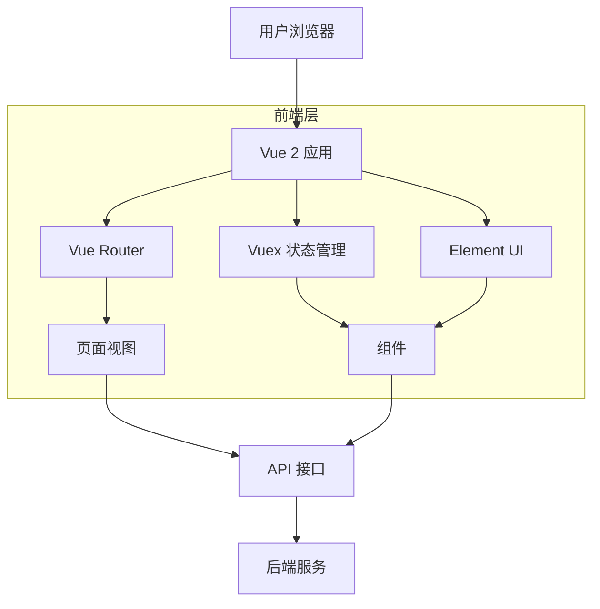

# JOSP-SystemTempleVue2

JOSP 系统模板 — Vue 2 前端版本。提供通用的后台管理系统前端模板。

## 技术栈

| 技术 | 版本 | 说明 |
|------|------|------|
| Vue.js | 2.7.16 | 前端框架 |
| Vue Router | 3.x | 路由管理 |
| Vuex | 3.x | 状态管理 |
| Element UI | 2.x | UI 组件库 |
| Webpack | 5.x | 构建工具 |

## 项目架构


```mermaid
graph TB
    User[用户浏览器] --> Vue[Vue 2 应用]
    
    Vue --> Router[Vue Router]
    Vue --> Vuex[Vuex 状态管理]
    Vue --> Element[Element UI]
    
    Router --> Views[页面视图]
    Vuex --> Components[组件]
    Element --> Components
    
    Views --> API[API 接口]
    Components --> API
    API --> Backend[后端服务]
    
    subgraph 前端层
        Vue
        Router
        Vuex
        Element
        Views
        Components
    end
```

## 功能介绍

- **权限管理**：基于角色的菜单和按钮权限控制
- **数据表格**：支持分页、筛选、排序的通用表格组件
- **表单引擎**：动态表单生成和验证
- **图表展示**：集成 ECharts 数据可视化

## 快速开始

```bash
# 安装依赖
npm install

# 开发模式
npm run serve
```

## 构建信息

```bash
npm run build
```
